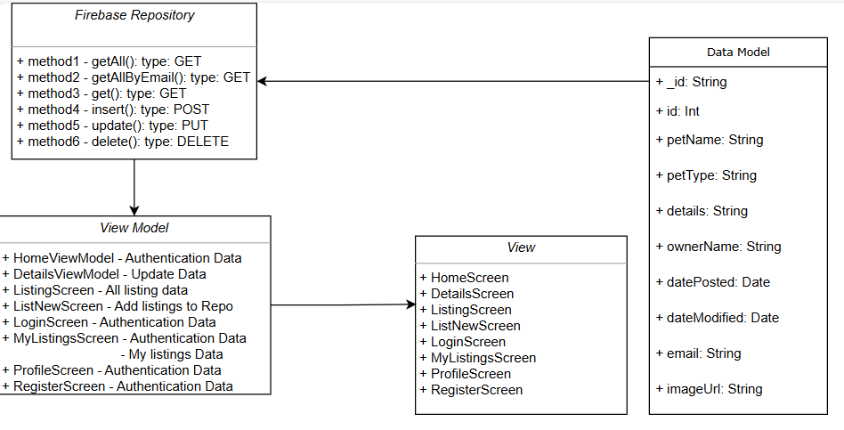
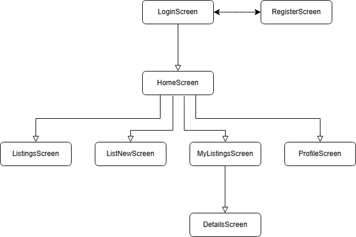

# Pet Adoption App

This mobile application is developed using the MVVM (Model-View-ViewModel) architecture, ensuring a clean separation of concerns and improved testability.
The app integrates with Firebase to handle:

🔐 Authentication

☁️ Cloud Firestore for data storage and real-time updates

## 🧱 Project Structure

- data/ – Contains Firebase repositories and data model classes.
- viewmodel/ – Holds the ViewModel classes that manage UI-related data and communicate with the repositories.
- views/ – Includes all UI components such as Composables, Activities, and Fragments.

## 📦 Features

- Built with the MVVM architecture for a clean separation of concerns
- Seamless Firebase integration for backend services like authentication and data storage
- Utilizes LiveData and ViewModel for reactive  UI updates
- Users can see the pet listings for adoption and list new post for available adoptions
- Users can register via email or using google account
- Users can update the profile picture for their local account
- Separate screen for showing listing by the user
- Users can update their listings
- Users can delete their own listings
- Users can logout through the profile page
- Option to filter the listings by the type of pet on the screen that shows all listings

## 🚀 Getting Started

1. Repository:
   ```bash
   https://github.com/Alex-Benoy/PetAdoption.git
   ```

### MVVM Class Diagram



### Screen Flow  Diagram

